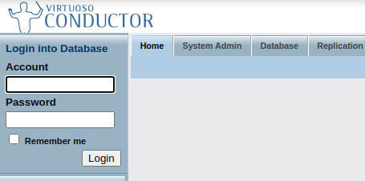
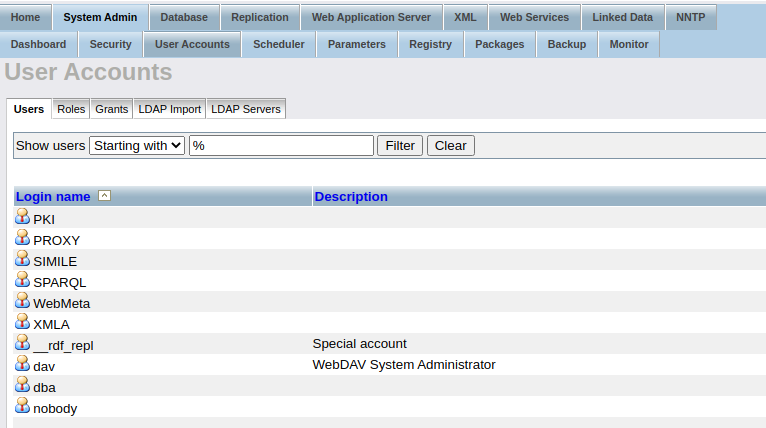
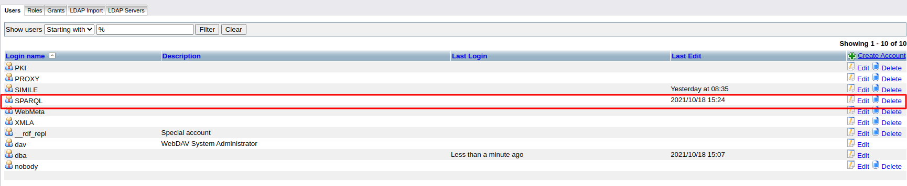
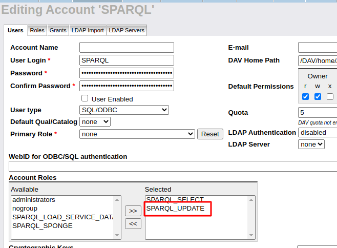

# Triple Store

Virtuoso triple store for the storage of the rdf data in the digital twin platform.

## Setting up virtuoso

The specific instructions on how to run the Virtuoso Docker are in this link:

https://hub.docker.com/r/openlink/virtuoso-opensource-7

### Instructions:

1. docker pull openlink/virtuoso-opensource-7
2. mkdir my_virtdb
3. cd my_virtdb
4. docker run \
        --name my_virtdb \
        --env DBA_PASSWORD=mysecret \
        -p 1111:1111 \
        -p 8890:8890 \
        --volume 'pwd':/database \
        -d \
        openlink/virtuoso-opensource-7:latest

Notes:

* The 'pwd' is the directory within the files systems where the data will be located.

* The -d flag will initialize it in detached mode (running in background)

* The conductor can be accessed at http://localhost:8890


### Stopping and starting the container

Stop container:

```docker stop my_virtdb```

Start container: This will run Virtuoso on the background.

```docker start my_virtdb```

### Giving rights to insert data

1. Access the conductor as dba user, using the password during the creation of the container.



2. Go to System Admin tab, then to the User Accounts tab, and then to the Users tabs.



3. Edit the SPARQL user.



4. Give it SPARQL_UPDATE rights.



5. Save it.

## Insert data in Virtuoso

Execute the following script:

`python insert_query.py graph_uri filepath`

## Query data in Virtuoso

Execute the following script:

`python select_query.py`
